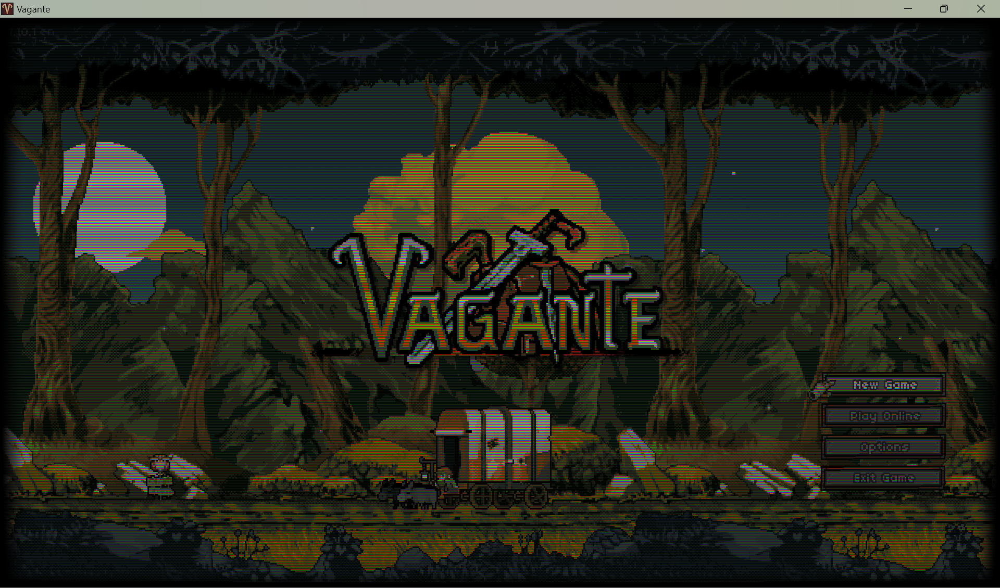

# vagante_crt_shader
Adds a CRT-like effect to Vagante.
(Instructions below)

You can install the mod for the effect by either replacing data.vra in your Vagante folder with the one from the releases tab, or you can repack vagante yourself after placing postprocessing.frag into the folder "...\vagante\data\gfx\shaders".

The in-game toggle for shaders must be on for this effect to work.

The slider in settings labled "Gamma" has been repurposed as a custom saturation effect.
Anything after the sixth "notch" on the slider will increase saturation while anything below will increase the screen warping.

This shader was writen by Teavery on Github.